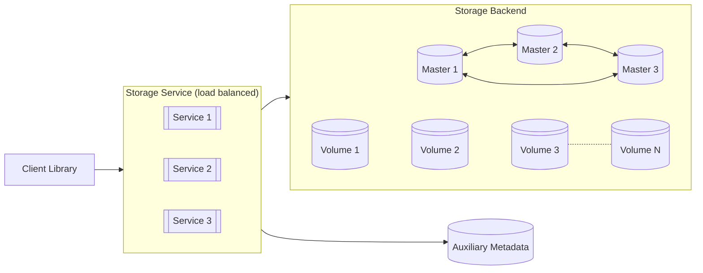

# Archtecture

## Concepts

### Usecase

The **usecase** would encapsulate higher-level capabilities, specific to a product/feature.

Capabilities can include things like TTL settings, quotas, etc.

The usecases would have to be provisioned directly in the infrastructure, and they would be exposed statically in client applications.

### Scope

The scope represents a partition and permission boundary.
We will most likely use the organization as the scope, but this can also be usecase specific, and be scoped to projects or repos instead.

As this scope represents a partition boundary, we can use this as a load-balancing and routing key.

### Ids / Keys

Some usecases, do not bring their own ids/keys/paths, and are fine with having ids allocated to them from the service itself.
This could just be a UUID, or whatever implementation is most efficient for the backend.

We might end up having to store an auxiliary table somewhere anyway to be able to do proper access control.

## Architectural Diagram

